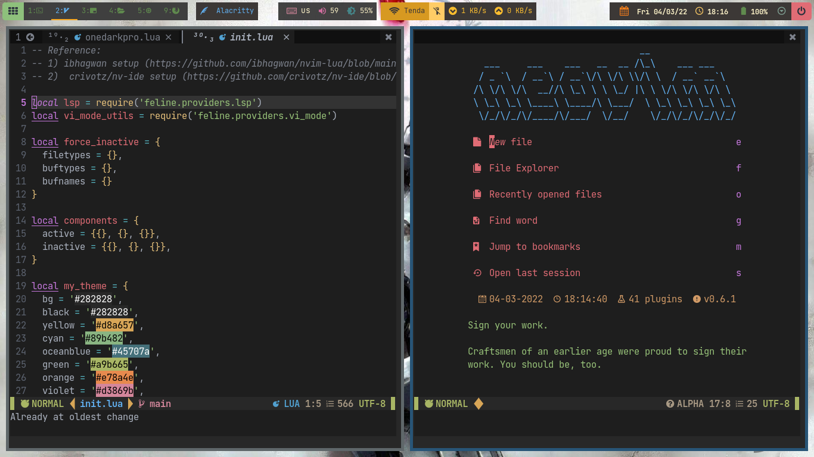
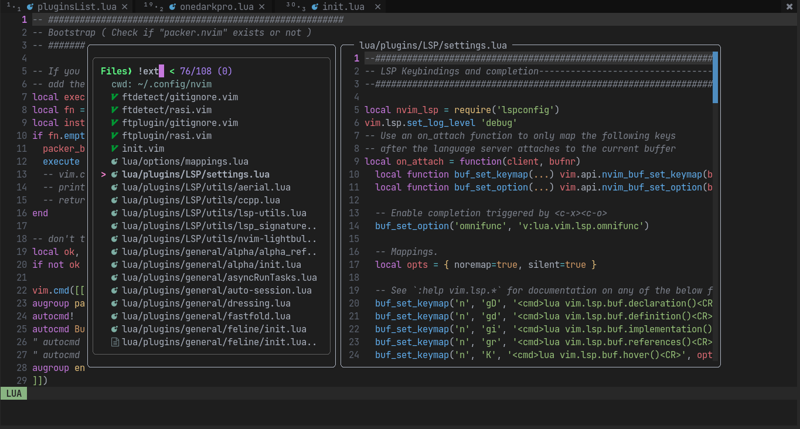
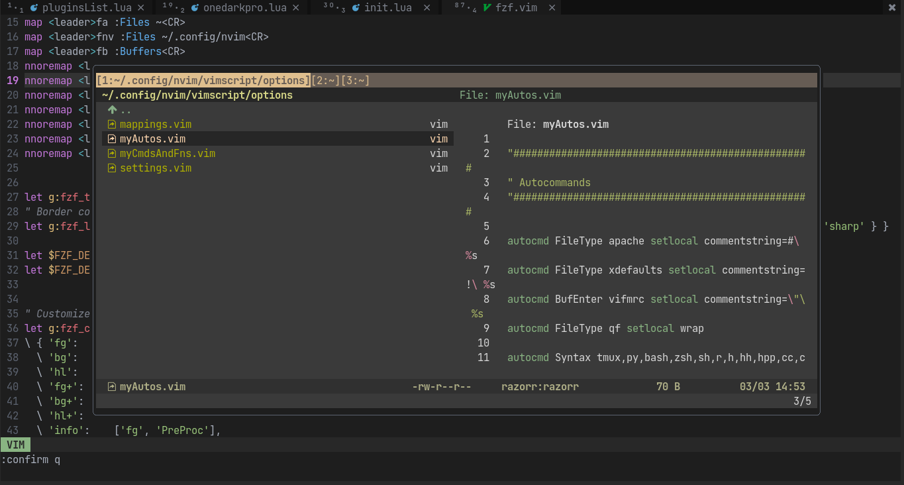

# My Neovim configurations

<h1 align="center">myNeovim</h1>

<!-- HEADERS -->

  

  <b> ~ Nvim configuration files ~ </b>

<!-- BADGES -->

    

    
    
   

<!-- INFORMATION -->

### Thanks for dropping by!
This is my custom configuration of [Neovim](https://github.com/neovim/neovim).\
Inspired and taken from many other configs in public repositories and content from [r/vim](https://www.reddit.com/r/vim/) and [r/neovim](https://www.reddit.com/r/neovim).

## To set up :

1. Install [Neovim](https://neovim.io/)
2. Clone the repository:  
  `git clone https://github.com/RayZ0rr/myNeovim.git`
3. Place the nvim folder inside `~/.config` folder ( `~` is your `$HOME` directory, i.e., `/home/<username>` ):  
`cp -r myNeovim/nvim ~/.config/`

That's pretty much it. Start neovim with `nvim` inside terminal or however you want and enjoy.  
( Note ⚠️ : opening neovim first time may throw errors. Close errors by pressing `<C-c>` (control + c) and type `:PaqSync:` or `:PaqInstall`. Might have to try this two times but it will be fully setup after that)

## 🖼️ Gallery

